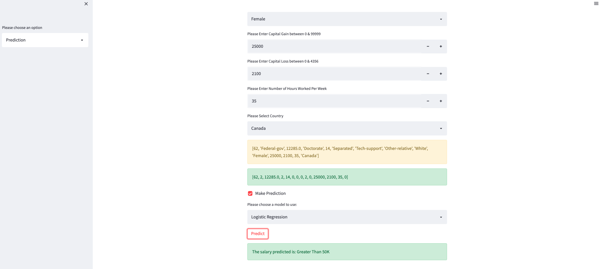
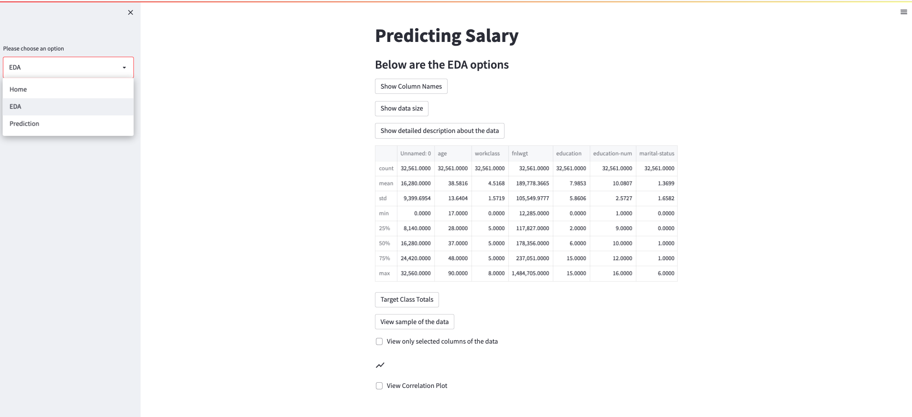

# Salary_Prediction

---

### Abstract:

The goal of this project is to build a classification machine learning model to predict the salary of an employee. An individual’s annual income results from various factors. Intuitively, it is influenced by the individual’s education level, age, gender, occupation, and etc.

An app was built using Streamlit and deployed on Heroku. The app allows for a user to input the listed features and select an algorithm to run which shows the results and allow for the classification model to predict the expected results. 

---

### Design:

 A pipeline was built to collect the data and perform machine learning to predict if the transaction was fraud and deployed an app to show the results. 

---

### Data:

The dataset contains 16 columns
Target filed: Income
-- The income is divide into two classes: <=50K and >50K
Number of attributes: 14
-- These are the demographics and other features to describe a person

Attribute Information:

1. age                
2. workclass          
3. fnlwgt             
4. education          
5. educational-num    
6. marital-status     
7. occupation         
8. relationship       
9. race               
10. gender             
11. capital-gain       
12. capital-loss       
13. hours-per-week     
14. native-country     
15. income             

---

### Machine Learning Algorithms

Machine Learning classification algorithms:
1.	Logistic Regression
2.	DecisionTree

---

### TOOLS:

The following tools were used in this project:
1.	SQL, Python & Pandas to clean, explore and generate the final modeling data
2.	Matplotlib and Seaborn to generate visualizations
3.	SKLearn to build Machine Learning classification models and measuring metrics
4.	Streamlit to develop the app
5.	Heroku to deploy the app.
6.	Docker to create a smooth pipeline.

---

### Communications:

The findings and slide deck accompanying this project's presentation are accessible in this GitHub repository.

